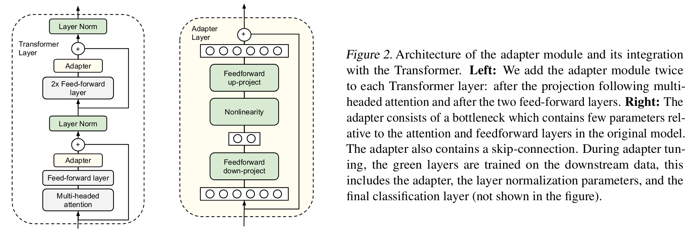

# Parameter-Efficient Transfer Learning for NLP

[](https://arxiv.org/abs/1902.00751)
[](http://proceedings.mlr.press/v97/houlsby19a.html)

This repository contains a paper implementation for ["Parameter-Efficient Transfer Learning for NLP"](https://arxiv.org/abs/1902.00751). The implementation uses pytorch-lightning and huggingface transformers. Currently the runs were performed for the 'CoLA' dataset from the [GLUE benchmark](https://gluebenchmark.com/tasks). The authors of this paper have proposed an adapter module for tranfer learning which is parameter efficient as compared to full finetuning. For demonstration, the BERT model has been used. Here is the overview of adapter module:  

  

All experiments run can be found here: [wandb/adapter-bert](https://wandb.ai/manan-shah/adapter-bert)

## Setup

### Clone repository

```
git clone https://github.com/cs-mshah/Adapter-Bert.git
```

### Environment

```
conda env create -f environment.yml
conda activate adapter
cd adapter-bert
```

### Structure

```
.
├── adapter-bert            
│   ├── cfgs                   # configurations to run
│   ├── config.py              # default configuration
│   ├── dataset.py             # LightningDataModule for GLUE tasks
│   ├── config.py              # main file for training
│   ├── model                  # model architectures
│       ├── bert.py            # modifications to huggingface/transformers/bert
│       ├── adapter.py         # adapter module
│       └── model.py           # LightningModule to train
├── assets                     # figures/outputs
├── environment.yml            # environment configuration
├── .gitignore                 # ignore files that cannot commit to Git
├── README.md                  # project description
├── LICENSE                    # Apache 2.0 License
```

## Training

[yacs](https://github.com/rbgirshick/yacs) is used as the configuration system and [wandb](https://wandb.ai/) for logging. You can change the configuration in `config.py` as it will get imported in `train.py` for training. For training run:

```
python train.py

# use saved config
python train.py --config cfgs/adapter.yaml
```

```
python train.py --help
usage: train.py [-h] [--config CONFIG]

Adapter-Bert

optional arguments:
  -h, --help       show this help message and exit
  --config CONFIG  path to yaml config
```

## References
[lightining examples: text transformers](https://lightning.ai/docs/pytorch/latest/notebooks/lightning_examples/text-transformers.html)  
[krypticmouse/Adapter-BERT](https://lightning.ai/docs/pytorch/latest/notebooks/lightning_examples/text-transformers.html)  
[huggingface/transformers](https://github.com/huggingface/transformers/tree/main/src/transformers/models/bert)

## Citation

Official paper citation:

```
@inproceedings{houlsby2019parameter,
  title = {Parameter-Efficient Transfer Learning for {NLP}},
  author = {Houlsby, Neil and Giurgiu, Andrei and Jastrzebski, Stanislaw and Morrone, Bruna and De Laroussilhe, Quentin and Gesmundo, Andrea and Attariyan, Mona and Gelly, Sylvain},
  booktitle = {Proceedings of the 36th International Conference on Machine Learning},
  year = {2019},
}
```